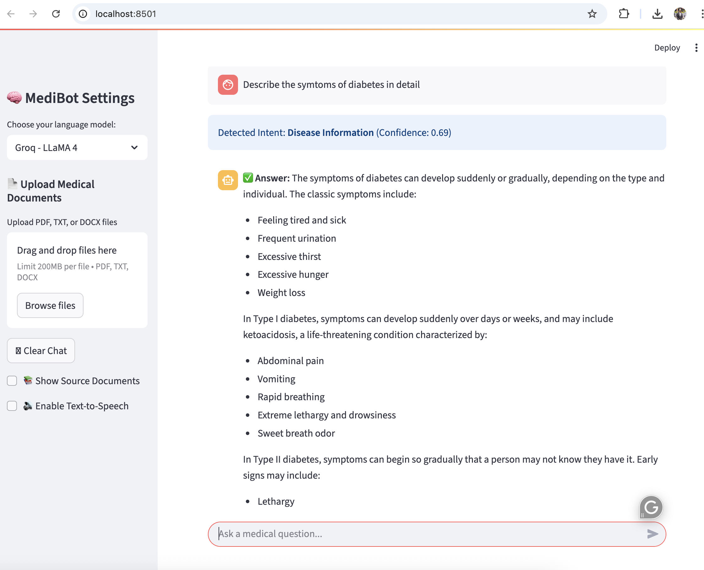

# Medical Chatbot 🤖💊

A powerful AI-powered medical chatbot application built with Streamlit and LangChain, designed to answer medical questions using uploaded documents and advanced language models.
## 📸 Demo



---

## Table of Contents

- [Project Overview](#project-overview)
- [Features](#features)
- [Installation](#installation)
- [Usage](#usage)
- [Project Structure](#project-structure)
- [Configuration](#configuration)
- [Contributing](#contributing)
- [License](#license)
- [Contact](#contact)

---

## Project Overview

The Medical Chatbot leverages state-of-the-art language models like Groq LLaMA 4 and HuggingFace Falcon 7B to answer users' medical queries. It supports uploading medical documents (PDF, TXT, DOCX), uses vector-based retrieval for relevant context, and falls back to Wikipedia when needed. The chatbot includes intent classification to ensure medical relevance and optional text-to-speech for accessibility.

---

## Features

- Upload and process medical documents (PDF, TXT, DOCX) for context-aware answers
- Vector store creation and updating using FAISS and embeddings
- Zero-shot intent classification for medical relevance
- Support for Groq LLaMA 4 and HuggingFace Falcon 7B language models
- Intelligent fallback to Wikipedia summary for unanswered questions
- Text-to-Speech functionality for answers
- Clean, interactive Streamlit web interface with chat history and source document previews

---

## Installation

1.  **Clone the repository:**
    ```bash
    git clone https://github.com/arpanneupane75/Medical-chatbot.git
    cd medical-chatbot
    ```

2.  **Create a Python virtual environment:**
    ```bash
    python -m venv venv
    source venv/bin/activate  # On Windows use `venv\Scripts\activate`
    ```

3.  **Install dependencies:**
    ```bash
    pip install -r requirements.txt
    ```

4.  **Set up environment variables:**
    Create a `.env` file in the root directory and add your Groq API key:
    ```ini
    GROQ_API_KEY=your_groq_api_key_here
    ```

---

## Usage

1.  **Run the Streamlit app:**
    ```bash
    streamlit run medibot.py
    ```

2.  Open your browser to the URL provided (usually `http://localhost:8501`).
3.  Use the sidebar to upload medical documents and choose your language model.
4.  Ask your medical questions in the chat input area.

---

## Project Structure
```bash
medical-chatbot/
│
├── connect_memory_with_llm.py # Connects vectorstore with LLM and QA chain
├── create_memory_for_llm.py # Handles embeddings, document processing, intent classification
├── medibot.py # Main Streamlit app interface and workflow
├── requirements.txt # Python dependencies
├── .env # Environment variables (not committed)
├── vectorstore/ # FAISS vectorstore data folder (generated)
└── README.md # Project documentation
```

## Configuration

-   **`GROQ_API_KEY`**: API key for Groq LLaMA 4 model, required for LLM access.
-   **File upload limit**: 200 MB per document.
-   **Models supported**: Groq LLaMA 4, HuggingFace Falcon 7B.
-   **Intent classification**: Uses zero-shot classification to filter out non-medical queries.

---

## Contributing

Contributions are welcome! Please follow these steps:

1.  Fork the repository.
2.  Create a feature branch (`git checkout -b feature/your-feature`).
3.  Commit your changes (`git commit -m 'Add new feature'`).
4.  Push to the branch (`git push origin feature/your-feature`).
5.  Open a pull request.

Please ensure code is well-documented and tests are added for new features.

---

## License

This project is licensed under the MIT License. See the `LICENSE` file for details.

## Contact

- **Name:** Arpan Neupane  
- **Email:** [arpanneupane75@gmail.com](mailto:arpanneupane75@gmail.com)  
- **Phone:** +977-9869540374  
- **GitHub:** [github.com/arpanneupane75](https://github.com/arpanneupane75)  
- **LinkedIn:** [linkedin.com/in/arpan-neupane-232a861b2](https://linkedin.com/in/arpan-neupane-232a861b2)  

---

**Thank you for using Medical Chatbot! 🚀**


 ```
